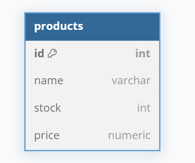

# 📦 StockTrack
API REST para gerenciamento básico de estoque e cadastro de produtos, permitindo operações de criação, leitura, atualização e exclusão (CRUD) de itens armazenados em banco de dados relacional.

## 🎯 Objetivo do Projeto
O projeto StockTrack foi desenvolvido com objetivo de facilitar o controle
de cadastro de produtos e estoque, utilizando um banco de dados relacional,
como o PostgreSQL.
Além disso, o projeto tem como finalidade a prática 
e o aprimoramento das habilidades em Java com o 
framework **Spring Boot** no desenvolvimento de APIs RESTful.

Com esta API, é possível:

- 📌 **Cadastrar produtos**, como, nome, preço, quantidade

- 📋 **Listar todos os produtos** cadastrados

- 📝 **Atualizar informações** de um produto

- 🗑️ **Deletar um produto** do estoque

- 📦 **Listar o total de itens no estoque**

- 💵 **Calcular o valor total do estoque**

## 🧠 Sobre a Modelagem



A modelagem foi feita de forma bem simples, sem foco em validações ou relacionamentos com outras entidades. O objetivo é armazenar dados de forma direta e objetiva, facilitando a manipulação das informações dos produtos.

## 📄 Script do banco
```SQL
CREATE TABLE product (
    id SERIAL PRIMARY KEY,
    name VARCHAR(255) NOT NULL,
    stock INTEGER NOT NULL,
    price NUMERIC(10,2) NOT NULL
    
);
```

## 📁 Estrutura do Projeto
```
src/main/java/com/stockTrack/
├── controller                # Endpoints da aplicação
├── model                     # Entidades e classes de domínio
├── repository                # Interface JPA para acesso ao banco
├── service                   # Lógica de negócio

src/main/resources/
├── db
│   ├── migration             # Modelagem do banco
├── application.properties    # Configurações da aplicação
```


## 🔗 Como Executar o Projeto

### ✅ Pré-requisitos
- Java JDK 17
- Git
- Intellij IDEA
- PostgreSQL
- Um cliente HTTP( como POSTMAN, Insomnia, Thunder Client)

**💡 Neste projeto foi utilizado o Postman, mas você pode utilizar o cliente HTTP de sua preferência.**

## 💻 Execução Local

#### 1. Clone o repositório pelo **IntelliJ IDEA**:

- Abra o IntelliJ IDEA.

-  **File > New > Project from Version Control**.

- Cole o link do repositório:
```bash
https://github.com/HenzoBragas/StockTrack.git   
```
- Clique em Clone.

#### 2. Instale todas as dependências do projeto 
    
 - No painel lateral, **clique em Maven > Reload All Maven Projects**
 (isso irá sincronizar todas as bibliotecas necessárias).

#### 3. Configure o banco de dados:

- Certifique-se de que o **PostgreSQL** está em execução.

- Atualize o arquivo **application.properties**  com suas credenciais e URL de conexão.

#### 4. Execute a aplicação
- Abra a classe principal **Application** com a anotação **@SpringBootApplication (geralmente StockTrackApplication.java)**.
- Execute a aplicação.

Se estiver tudo certo, verá no terminal:
```bash
=======================================================
✅ A aplicação StockTrack está rodando na porta 8080
📌 Acesse: http://localhost:8080
=======================================================
```

## 📬 Endpoints da API 

- `/products`
- `/summary`

## 📊 Por que criar a rota /summary?

A rota /summary oferece uma visão rápida do total de itens no estoque e do valor financeiro total. Isso facilita o controle, ajuda na tomada de decisões e evita que o cliente precise calcular esses dados manualmente. É uma forma prática e eficiente de monitorar o estoque em tempo real.


## Exemplo de Requisição

### 🔹 GET /products
- Retorna todos os produtos cadastrados.

#### Exemplo de resposta:
```JSON
[
  {
    "id": 1,
    "nome": "Teclado Mecânico",
    "preco": 250.00,
    "quantidade": 10
  },
  {
    "id": 2,
    "nome": "Mouse Gamer",
    "preco": 150.00,
    "quantidade": 5
  }
]
```
### 🔹 POST /products 
- Cadastra um novo produto.

#### Exemplo de requisição:

```JSON
{
  "nome": "Monitor 24 polegadas",
  "preco": 899.99,
  "quantidade": 7
}
```
#### Exemplo de resposta:
```JSON
{
  "id": 3,
  "nome": "Monitor 24 polegadas",
  "preco": 899.99,
  "quantidade": 7
}
```

### 🔹 PUT /products/{id}
- Atualiza um produto existente.

#### Exemplo de requisição:
```JSON
{
  "nome": "Teclado Mecânico RGB",
  "preco": 299.99,
  "quantidade": 8
}
```
#### Exemplo de resposta:

```JSON
{
  "id": 1,
  "nome": "Teclado Mecânico RGB",
  "preco": 299.99,
  "quantidade": 8
}
```
### 🔹 DELETE /products/{id}
- Remove um produto do estoque.

### Exemplo de resposta (sucesso):
```JSON
{
  "mensagem": "Produto removido com sucesso."
}
```

### 🔹 GET /summary
- Retorna o resumo do estoque: total de produtos e valor total.

#### Exemplo de resposta:
```JSON
{
  "quantidadeTotal": 22,
  "valorTotalEstoque": 6750.93
}
```

## 🚀 Tecnologias Utilizadas

- Java 17
- Spring Boot
- Maven
- PostgreSQL
- Flyway 
- Lombok
- JDBC 
- Postman 
